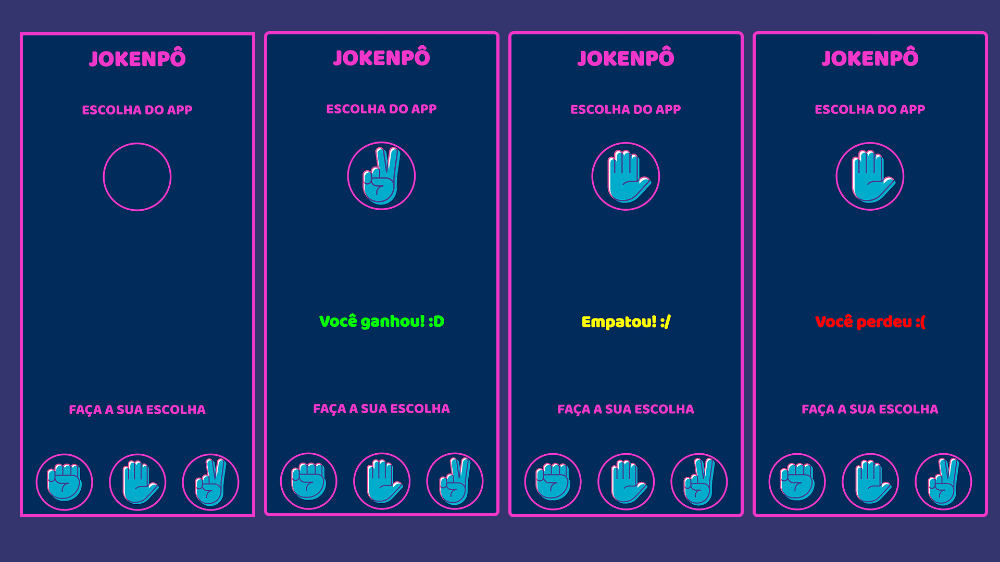

# 🎮 Jokenpô – Pedra, Papel e Tesoura  

  

---

## 📖 Sobre o Projeto
Este é um aplicativo Android do clássico jogo **Jokenpô (Pedra, Papel e Tesoura)**.  
O usuário escolhe entre **Pedra**, **Papel** ou **Tesoura**, e o app realiza uma escolha aleatória, exibindo o resultado na tela com mensagens e cores diferentes.  

Projeto desenvolvido durante o curso **Desenvolvimento Android** do professor **Jamilton Damasceno**.  

---

## 🚀 Funcionalidades
- Escolha entre **Pedra, Papel e Tesoura** com apenas um clique.  
- Escolha do app feita de forma **aleatória**.  
- Resultado exibido com **cores distintas**:  
  - 🟢 Vitória  
  - 🔴 Derrota  
  - 🟡 Empate  
- Alteração da imagem conforme a jogada do app.  

---

## 🖼️ Prints do Aplicativo
*(adicione aqui as imagens do app rodando)*  

Exemplo:  
  

---

## 📂 Como Executar o Projeto
1. Clone este repositório:  
   ```bash
